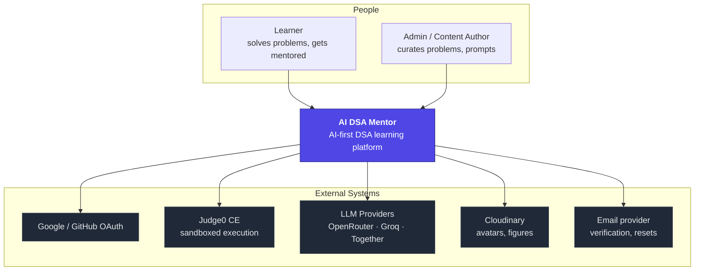
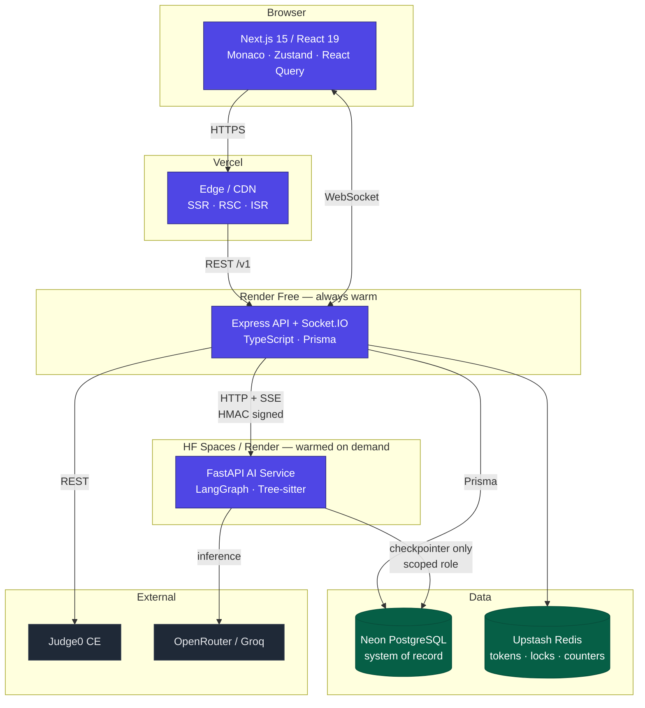
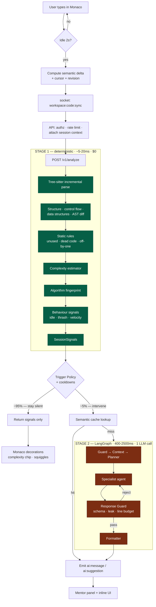
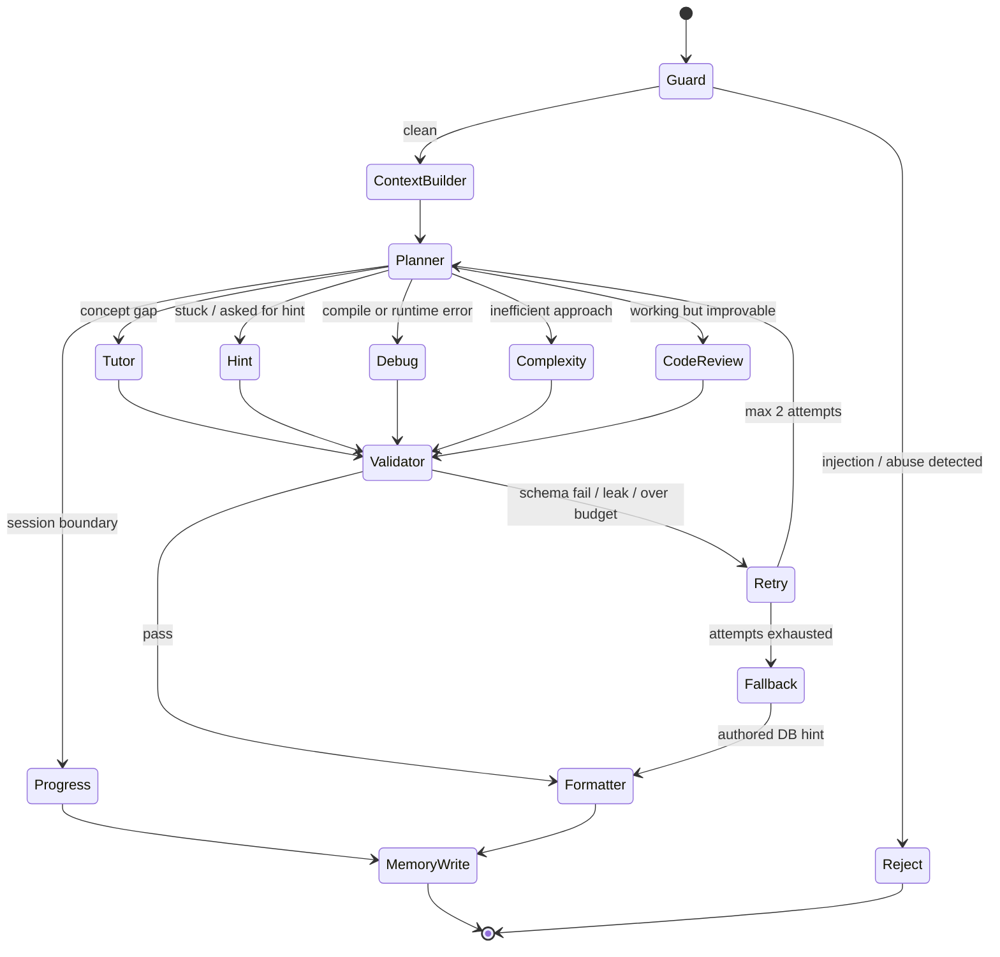
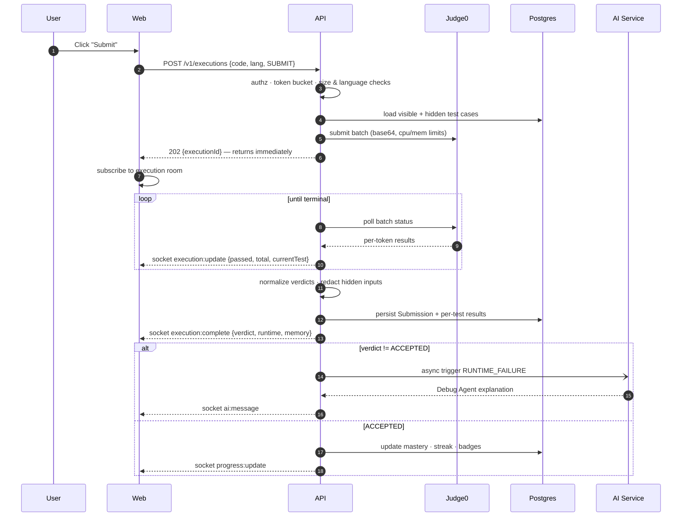
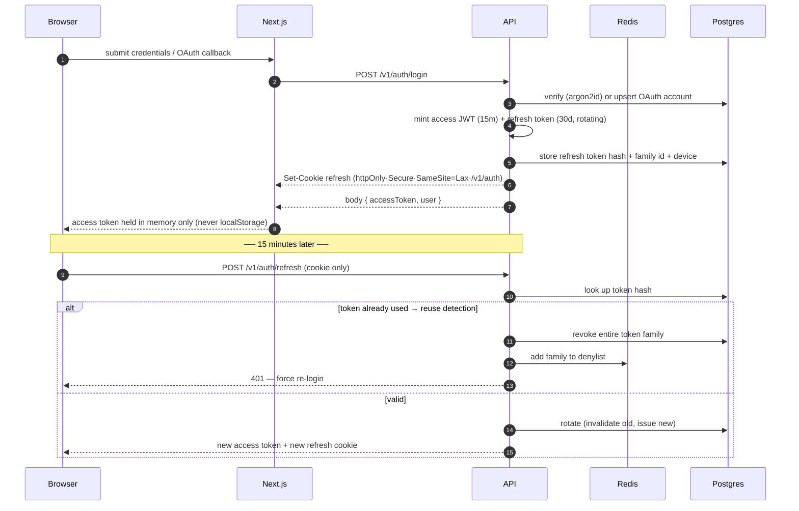
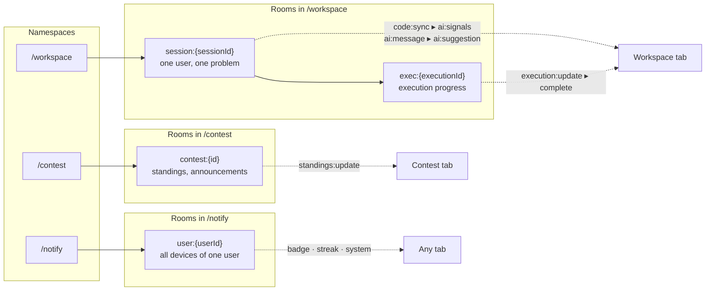
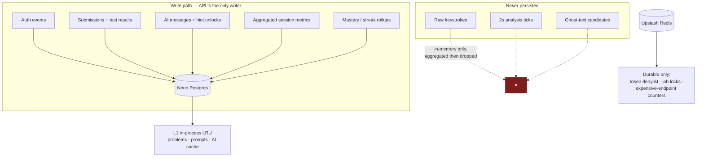
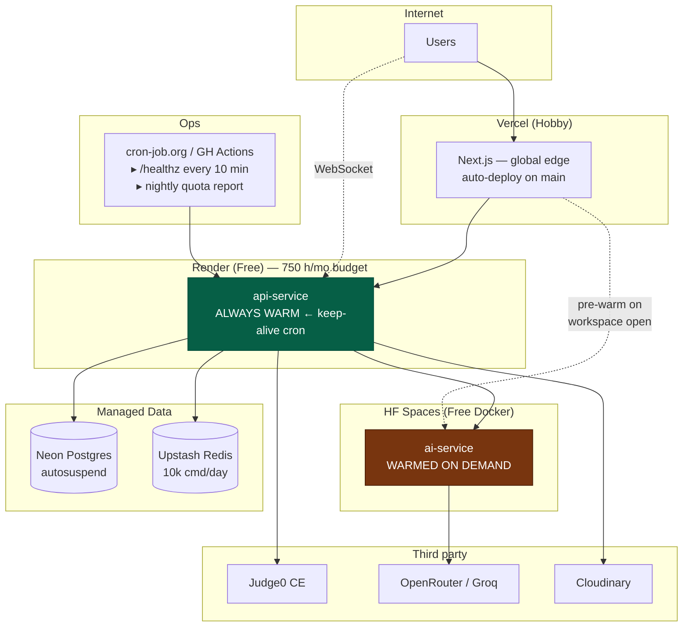
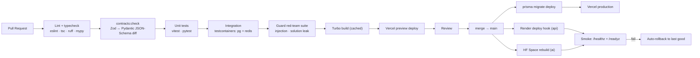

# 03 — Architecture Diagrams

**Phase 1 deliverable 3 of 8**
All diagrams are Mermaid — they render in GitHub, VS Code, and published artifacts.

---

## 1. System context (C4 Level 1)

---

## 2. Container view (C4 Level 2)

**Read the arrows carefully — they encode the security model.** The browser never reaches the AI service, Judge0, or the database. The AI service never reaches application data. Only the API sits on more than one trust boundary, which is exactly where authorization belongs.

---

## 3. The two-stage AI pipeline (the core mechanism)

---

## 4. LangGraph agent graph

**Why `Validator → Retry → Planner` and not `Validator → Agent`:** a rejected response often means the *wrong specialist* was chosen (e.g. Hint Agent asked to explain a segfault). Routing the retry back through the Planner with the rejection reason attached lets the system self-correct its routing, not just its wording.

---

## 5. Execution flow (Run / Submit)

Note step 5: the API returns `202` immediately and streams progress over the socket. On free tier this matters — a synchronous request that waits for Judge0 would sit open long enough to be killed by an idle proxy timeout.

---

## 6. Authentication flow

Refresh-token **reuse detection with family revocation** is the control that turns a stolen refresh token from a persistent compromise into a single-use anomaly that logs the attacker *and the victim* out.

---

## 7. Real-time channel topology

Rooms are scoped to a **session**, not a user, so the same person solving two problems in two tabs gets two independent mentor contexts — which is correct, since the mentor's state is per-problem.

---

## 8. Data flow & ownership

Neon Free's ~0.5 GB ceiling is the reason the "never persisted" box exists (ADR-010). A naive edit-event log at 2-second granularity would write roughly 1,800 rows per user-hour and exhaust free storage within days.

---

## 9. Deployment topology

The dotted `V → HA` edge is ADR-004 in one line: **the user opening a problem is what wakes the AI service**, so cold start hides behind reading time instead of behind a spinner.

---

## 10. CI/CD pipeline

`contracts:check` and the Guard red-team suite are non-negotiable gates: the first prevents silent API drift across three languages, the second prevents a prompt edit from quietly turning the mentor into an answer key.
