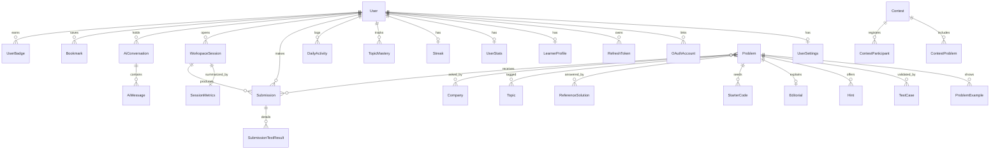

# 04 — Database Design

**Phase 1 deliverable 4 of 8**
Engine: **PostgreSQL 16 (Neon)** · ORM: **Prisma**
Canonical schema file: [packages/db/prisma/schema.prisma](../../packages/db/prisma/schema.prisma)

---

## 1. Design principles

1. **Postgres is the only system of record.** Redis holds nothing that cannot be rebuilt.
2. **Storage discipline is a first-class constraint.** Neon Free is ~0.5 GB. Every high-cardinality write path is either aggregated before insert or given an explicit retention policy (§6). This is ADR-010 made concrete.
3. **Denormalize deliberately, and name it.** `Problem.acceptanceRate`, `UserStats.*`, and `TopicMastery.mastery` are computed rollups. They are always written by a named job or service method, never ad hoc, so there is exactly one place that can make them wrong.
4. **Sensitive content is isolated at the row level.** `ReferenceSolution` and hidden `TestCase` rows are never selectable through any user-facing repository method — the repositories expose no path to them, and separate admin repositories do.
5. **Soft delete only where recovery matters** (users, problems, contests). Ephemeral rows hard-delete.
6. **Every foreign key has an explicit `onDelete`.** No implicit cascades.

---

## 2. Domain map



---

## 3. Table catalogue

Grouped by bounded context, with the non-obvious columns explained. Full DDL is in the schema file.

### 3.1 Identity & access

| Table | Purpose | Notes |
|---|---|---|
| `User` | Account root | `email` is `citext` — case-insensitive uniqueness without a functional index. `deletedAt` soft-delete. |
| `UserSettings` | Editor/AI/appearance prefs | Split from `User` so the hot `User` row stays narrow; settings are read once per session, not per request. |
| `OAuthAccount` | Google/GitHub links | `@@unique([provider, providerAccountId])`. One user may hold several. |
| `RefreshToken` | Rotating refresh tokens | Stores **hash only**. `familyId` enables reuse-detection family revocation (`03 §6`). `replacedById` forms the rotation chain. |
| `VerificationToken` | Email verify + password reset | Single table, `purpose` enum, single-use, TTL-indexed. |

### 3.2 Content

| Table | Purpose | Notes |
|---|---|---|
| `Problem` | Problem root | `statementDigest` is the pre-compressed form fed to the LLM (`01 §6`) — computed at publish time so we never tokenize raw markdown per request. `expectedTimeComplexity` drives the `COMPLEXITY_GAP` trigger. |
| `ProblemExample` | Rendered examples | Ordered; supports an optional figure URL for visual explanations. |
| `Topic` | Taxonomy | Self-referencing `parentId` — "Graphs → Shortest Path → Dijkstra". |
| `Company` | Company tags | `ProblemCompany.frequency` + `lastAskedAt` powers "recently asked at X". |
| `Hint` | Authored progressive hints | `level` 1–3 maps to the Hint Agent's ladder **and** is the zero-cost fallback when all LLM providers fail (`01 §7`). |
| `Editorial` | Official solution write-up | `isLockedUntilSolved` respected by the API, not the client. |
| `TestCase` | Visible + hidden tests | `isHidden` rows are never serialized to any client response. `weight` supports partial scoring in contests. |
| `StarterCode` | Per-language stubs | `@@unique([problemId, language])`. |
| `ReferenceSolution` | Official solutions | **Highest-sensitivity table.** `normalizedTokens` is a pre-computed identifier-insensitive token stream used by the Response Guard's similarity check (`01 §5.4`) so the raw solution never enters a prompt. |

### 3.3 Workspace & execution

| Table | Purpose | Notes |
|---|---|---|
| `WorkspaceSession` | One user × one problem × one sitting | The unit the mentor reasons about. Socket rooms are keyed on it. |
| `SessionMetrics` | Aggregated behaviour | **One row per session, written once at session end** (plus periodic upserts for crash safety). This is the ADR-010 compromise: full behavioural fidelity, ~1 row/session instead of ~1,800. |
| `CodeDraft` | Persistent per-language draft | `@@unique([userId, problemId, language])`. Monotonic `revision` for last-write-wins conflict resolution across tabs/devices. Guarantees code is never lost on socket drop. |
| `Submission` | Run/Submit record | `mode` distinguishes RUN from SUBMIT; only SUBMIT affects stats. `contestId` nullable — contest submissions are ordinary submissions with a scope. |
| `SubmissionTestResult` | Per-test outcome | For hidden tests, `stdout`/`expected` are stored truncated and are stripped in the API response layer. |

### 3.4 AI

| Table | Purpose | Notes |
|---|---|---|
| `AiConversation` | One thread per (user, problem) | `@@unique([userId, problemId])` — this is the schema-level expression of "each problem has its own permanent conversation". `summary` holds rolling compression so old turns cost nothing to carry. |
| `AiMessage` | Turns | Records `agent`, `trigger`, `model`, token counts, `latencyMs`, `cacheHit`, `guardRejections`. This is the observability spine for prompt quality work. |
| `HintUnlock` | Ladder progress | Prevents hint-level regression and feeds `LearnerProfile.hintDependency`. |
| `AiFeedback` | 👍/👎 per message | Closes the loop on prompt iteration; later becomes fine-tuning preference data. |
| `PromptTemplate` | Admin-editable prompts | Versioned + `isActive`. Registry checks DB first, falls back to shipped file (`02`). |
| `AiUsageDaily` | Quota accounting | `@@unique([date, userId, model])`. Drives daily caps and the nightly quota report. Fixed-cardinality — safe under storage limits. |

### 3.5 Learning model

| Table | Purpose | Notes |
|---|---|---|
| `LearnerProfile` | Per-user learner state | `hintDependency` (0–1) and `confidence` (0–1) directly modulate trigger thresholds — a confident user gets left alone longer. |
| `TopicMastery` | Per-topic mastery | `mastery` 0–1 with `decayAt`: mastery **decays** if not practised, which is what makes the recommendation engine behave like spaced repetition rather than a checklist. |
| `MisconceptionFlag` | Recurring specific errors | e.g. `off-by-one-in-binary-search`. Surfaced in the context envelope so the mentor can say "this is the third time — let's fix the pattern, not the line." |
| `DailyActivity` | Heatmap + streak source | `@@unique([userId, date])`. 365 rows/user/year — bounded and cheap. |
| `Streak` | Current/longest | Denormalized from `DailyActivity` by a nightly job. |
| `UserStats` | Leaderboard-ready counters | Denormalized; recomputable from `Submission` at any time. |

### 3.6 Gamification, contests, misc

`Badge`, `UserBadge`, `LeaderboardSnapshot`, `Contest`, `ContestProblem`, `ContestParticipant`, `Bookmark`, `ProblemList`, `ProblemListItem`, `Note`, `Notification`, `AuditLog`.

`LeaderboardSnapshot` exists because ranking by live aggregation over `Submission` is the classic query that quietly becomes the slowest thing in the system. A scheduled job materializes ranks per scope (`GLOBAL`, `WEEKLY`, `MONTHLY`, `CONTEST`), and reads hit a single indexed table.

---

## 4. Indexing strategy

Indexes are chosen from the actual query list in `05-api-design.md`, not speculatively — each one below has a named consumer.

| Index | Serves |
|---|---|
| `Problem(status, difficulty)` | Problem list default filter |
| `Problem(slug)` unique | Detail route |
| `Problem` GIN `pg_trgm` on `title` | Type-ahead search |
| `ProblemTopic(topicId, problemId)` | Filter-by-topic |
| `ProblemCompany(companyId, frequency DESC)` | "Top asked at Google" |
| `Submission(userId, problemId, createdAt DESC)` | Per-problem submission history |
| `Submission(userId, verdict, createdAt DESC)` | Solved-set + activity feed |
| `Submission(contestId, userId, createdAt)` | Contest scoring |
| `TestCase(problemId, isHidden, index)` | Execution test loading (the hottest join) |
| `AiMessage(conversationId, createdAt)` | Thread pagination |
| `TopicMastery(userId, mastery ASC)` | Weak-topic recommendation |
| `DailyActivity(userId, date DESC)` | Heatmap |
| `LeaderboardSnapshot(scope, periodKey, rank)` | Leaderboard pages |
| `RefreshToken(tokenHash)` unique | Refresh path |
| `RefreshToken(familyId)` | Reuse-detection revocation |

**Deliberate non-indexes:** no index on `Submission.code`, `AiMessage.content`, or any large text column. Full-text search over submissions is not a product requirement, and those indexes would cost more storage than the data.

---

## 5. Consistency & transactions

| Operation | Boundary |
|---|---|
| Submission finalize | Single transaction: `Submission` + `SubmissionTestResult[]` + `Problem` counter increments. Stats/mastery/badges are **outside** the transaction, applied idempotently, keyed on `submissionId`. |
| Refresh rotation | Transaction: invalidate old + insert new. Reuse detection revokes the whole family in one statement. |
| Contest scoring | Advisory lock per contest during finalize; participant rank writes in one transaction. |
| Mastery update | Idempotent upsert keyed on `(userId, topicId)`; safe to replay. |

Long-running work never holds a transaction open. Judge0 polling happens entirely outside any DB transaction — on a 0.1-CPU free instance, a transaction held across a network wait is how you exhaust the connection pool.

---

## 6. Storage budget & retention (Neon Free ~0.5 GB)

| Table | Row estimate | Growth per active user/month | Policy |
|---|---|---|---|
| `Problem` + children | ~500 problems | static | permanent |
| `Submission` | ~1 KB (code) | ~120 rows ≈ 120 KB | keep last 50 per (user, problem); prune older non-accepted |
| `SubmissionTestResult` | ~200 B | ~1,200 rows ≈ 240 KB | truncate outputs to 2 KB; prune with parent |
| `AiMessage` | ~800 B | ~150 rows ≈ 120 KB | summarize + prune turns older than 90 days |
| `SessionMetrics` | ~300 B | ~30 rows ≈ 9 KB | permanent (this is the learning signal) |
| `DailyActivity` | ~80 B | 30 rows ≈ 2.4 KB | permanent |
| `AuditLog` | ~500 B | admin only | 180-day retention |
| **Per active user/month** | | **≈ 0.5 MB** | ≈ 1,000 user-months on free tier |

A nightly `retention.job.ts` enforces every policy above and logs reclaimed bytes. The point is not that 0.5 GB is enough forever — it is that the system **degrades by pruning history, not by falling over**, and the pruning rules are explicit rather than emergent.

---

## 7. LangGraph checkpointer

LangGraph's Postgres checkpointer manages its own tables. They live in a dedicated `langgraph` schema, owned by a distinct role with `USAGE` on that schema only — **no grants on `public`**. Prisma neither models nor migrates them. This is the concrete implementation of ADR-003: even a fully compromised AI service cannot read `User`, `Submission`, or `ReferenceSolution`.

---

## 8. Canonical Prisma schema

The complete, migration-ready schema is written to [packages/db/prisma/schema.prisma](../../packages/db/prisma/schema.prisma). Highlights of the conventions used there:

```prisma
// Case-insensitive email without a functional index
email String @unique @db.Citext

// Money-free scoring: integers only, no floats for anything ranked
score Int @default(0)

// Every FK states its deletion semantics explicitly
user User @relation(fields: [userId], references: [id], onDelete: Cascade)
problem Problem @relation(fields: [problemId], references: [id], onDelete: Restrict)

// Rollups are nullable-free with sane defaults so reads never branch on null
totalSolved Int @default(0)

// Soft delete is opt-in per model, enforced by a Prisma client extension
deletedAt DateTime?
```

Run `pnpm --filter @repo/db migrate:dev` to generate the initial migration once Phase 2 begins.
