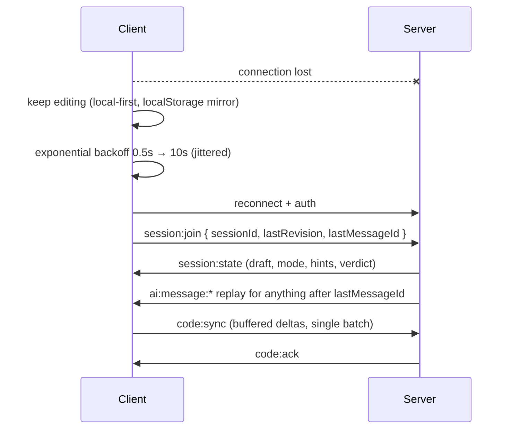

# 06 — Socket Design

**Phase 1 deliverable 6 of 8**
Transport: **Socket.IO v4** on the Express server · Contracts: `packages/contracts/socket`

---

## 1. What belongs on the socket (and what doesn't)

A common failure mode is putting everything on the socket because it's there. The rule used here:

> **The socket carries state that changes without a user action.** Everything a user explicitly requests and waits for stays on REST.

| Over socket | Over REST |
|---|---|
| AI signals from the 2 s analysis tick | Loading a problem |
| Proactive mentor messages | Saving settings |
| Streaming AI tokens | Fetching the leaderboard |
| Per-test execution progress | Submitting code (`202` then socket) |
| Contest standings | Registering for a contest |
| Badge/streak notifications | Profile updates |

Consequence: **the app is fully usable with the socket down.** Every socket event has a REST equivalent or a graceful no-op. On a free tier that sleeps, this is not optional.

---

## 2. Namespaces

| Namespace | Purpose | Auth |
|---|---|---|
| `/workspace` | Coding session: code sync, AI, execution progress | Required |
| `/contest` | Live standings, announcements, timer sync | Required + registered |
| `/notify` | User-level notifications across all tabs | Required |

Namespaces (not just rooms) because each has a different auth predicate, a different rate-limit profile, and a different degradation story. A contest DDoS should not affect the mentor.

---

## 3. Rooms

| Room | Members | Lifetime |
|---|---|---|
| `session:{sessionId}` | The tabs of one user on one problem | Session open → end |
| `exec:{executionId}` | Subscribers to one execution | Submit → terminal verdict |
| `contest:{contestId}` | All participants | Contest window |
| `user:{userId}` | All connections of one user | Connection lifetime |

Rooms are keyed on **session**, not user, so the same person solving two problems in two tabs gets two independent mentor contexts — which is correct, because mentor state is per-problem (`AiConversation` is unique per `(userId, problemId)`).

---

## 4. Handshake & authentication

```ts
// Client
const socket = io(`${API_URL}/workspace`, {
  auth: { token: accessToken },        // access JWT, not the refresh cookie
  transports: ['websocket'],           // skip the polling upgrade dance
  reconnectionDelay: 500,
  reconnectionDelayMax: 10_000,        // capped exponential backoff
  timeout: 10_000,
});
```

Middleware chain on connect:

1. **Verify JWT** → `socket.data.user`. Invalid ⇒ disconnect with `AUTH_FAILED`.
2. **Connection cap** — max 5 concurrent sockets per user; oldest evicted. Prevents a reconnect loop from exhausting a 512 MB instance.
3. **Attach rate limiters** — a per-socket token bucket per event class (§7).
4. **Bind lifecycle** — on `disconnect`, flush pending `SessionMetrics` and mark the session idle rather than ended (a refresh must not end a session).

**Token expiry mid-connection.** The access token lives 15 minutes; sockets live longer. The server checks expiry on every *authenticated action*, not just at handshake, and emits `auth:expired`. The client refreshes over REST and calls `socket.emit('auth:renew', { token })` — no reconnect, no lost session state.

---

## 5. Event catalogue

All events are typed end-to-end via `ServerToClientEvents` / `ClientToServerEvents` in `packages/contracts/socket`, so `socket.emit` is compile-time checked in both the API and the web app.

### 5.1 `/workspace` — client → server

| Event | Payload | Notes |
|---|---|---|
| `session:join` | `{ sessionId }` | Joins `session:{id}`; server replies with a state snapshot (ack) |
| `session:leave` | `{ sessionId }` | |
| `code:sync` | `{ sessionId, revision, delta \| full, cursor, language }` | **Debounced 2 s client-side.** Sends a delta; full buffer only every 10th sync or on reconnect |
| `code:cursor` | `{ sessionId, line, col }` | Throttled to 1/s; feeds dwell detection |
| `behaviour:tick` | `{ sessionId, idleMs, editCount, backspaces, dwellLine }` | Client-side half of the behavioural signals; 5 s cadence |
| `ai:chat:send` | `{ sessionId, content, selection? }` | Ack returns `messageId` immediately |
| `ai:chat:cancel` | `{ messageId }` | Aborts the upstream LLM stream — real token savings |
| `ai:hint:request` | `{ sessionId, level? }` | |
| `ai:mode:set` | `{ sessionId, assistMode }` | Changes trigger policy live |
| `ai:dismiss` | `{ suggestionId, reason }` | Trains the trigger cooldowns: dismissals lengthen them |
| `exec:subscribe` | `{ executionId }` | |
| `auth:renew` | `{ token }` | |

### 5.2 `/workspace` — server → client

| Event | Payload | When |
|---|---|---|
| `session:state` | Full snapshot: draft, mode, hints used, last verdict | On join / reconnect |
| `code:ack` | `{ revision, savedAt }` | Confirms the draft is durable |
| `ai:signals` | `{ complexity, warnings[], structure, algorithm, progress }` | **Every tick — the 95% path.** Deterministic, zero LLM |
| `ai:suggestion` | `{ id, kind, range, content, severity, dismissible }` | Inline decoration (squiggle, gutter hint, complexity chip) |
| `ai:message:start` | `{ messageId, agent, trigger }` | |
| `ai:message:token` | `{ messageId, t }` | Streaming |
| `ai:message:block` | `{ messageId, block }` | Structured block (code, diagnostic, hint step) |
| `ai:message:done` | `{ messageId, tokens, latencyMs, cacheHit }` | |
| `ai:message:error` | `{ messageId, code, fallbackUsed }` | Terminal; client renders fallback content |
| `ai:ghost` | `{ requestId, text, range }` | High Assist inline completion |
| `ai:hint:unlocked` | `{ level, content, remaining }` | |
| `ai:typing` | `{ agent }` | Presence indicator while the graph runs |
| `exec:queued` | `{ executionId, totalTests }` | |
| `exec:update` | `{ executionId, completed, total, lastVerdict }` | Per-test progress |
| `exec:complete` | `{ executionId, verdict, runtimeMs, memoryKb, results[] }` | Hidden tests redacted |
| `progress:update` | `{ xp, streak, masteryDeltas[] }` | After an accepted submit |
| `quota:warning` | `{ resource, remaining, resetAt }` | Fires at 20% remaining, before the wall |
| `auth:expired` | `{}` | Prompts `auth:renew` |
| `system:degraded` | `{ subsystem, reason, until? }` | Drives the honest-degradation banner |

### 5.3 `/contest`

Client → server: `contest:join`, `contest:leave`.
Server → client: `standings:update` (throttled to 1 per 10 s, diff-only), `contest:announcement`, `contest:timer` (server-authoritative remaining time — never trust the client clock for scoring), `contest:ended`.

### 5.4 `/notify`

Server → client only: `notification:new`, `badge:earned`, `streak:reminder`, `system:broadcast`.

---

## 6. The code-sync protocol

This is the highest-frequency path in the system and the one place where getting the protocol wrong loses user work.

```
Monaco onDidChangeModelContent
  └─ push to local edit buffer  (always, synchronously)
      └─ debounce 2000 ms, leading:false, trailing:true
          └─ revision++ ; build delta since last acked revision
              └─ emit code:sync { revision, delta, cursor }
                  ├─ ack within 3 s  → mark durable, drop buffered deltas
                  └─ no ack / offline → keep buffer, retry on reconnect
```

**Guarantees and how they're obtained:**

| Guarantee | Mechanism |
|---|---|
| Code is never lost | Buffer is local-first; also mirrored to `localStorage` on every debounce tick. The socket is a *sync* channel, not the source of truth (ADR-011) |
| No duplicate AI work | Server ignores a `code:sync` whose `revision` ≤ the last processed revision |
| Multi-tab consistency | `CodeDraft.revision` is monotonic; a stale write gets `code:conflict` and the client offers merge-or-overwrite rather than silently clobbering |
| Bounded payload | Deltas only; full buffer every 10th sync or on reconnect; hard 64 KB cap |
| Analysis is not spammed | Server-side coalescing: if a new sync arrives while an `/v1/analyze` call is in flight for that session, the in-flight call is **cancelled** and the newest state is analysed instead |

That last row matters more than it looks. A user typing continuously would otherwise queue analysis calls faster than they complete; cancel-and-replace keeps exactly one analysis in flight per session, permanently.

---

## 7. Rate limiting & backpressure

Per-socket token buckets, refilled continuously:

| Event | Bucket |
|---|---|
| `code:sync` | 40 / min (client debounce yields ~30) |
| `code:cursor` | 60 / min |
| `behaviour:tick` | 20 / min |
| `ai:chat:send` | 20 / hour |
| `ai:hint:request` | 15 / hour |
| `ai:ghost` (implicit) | 30 / min |
| any event | 200 / min aggregate |

On breach: the event is dropped and `rate:limited { event, retryAfter }` is emitted. Three breaches in 60 s ⇒ disconnect with `ABUSE`. Buckets are in-process (ADR-006) — correct at one instance, and they become the L1 of a two-tier limiter when we scale.

**Backpressure:** before emitting a token stream, the server checks `socket.conn.writeBuffer.length`. Past a threshold it coalesces tokens into larger chunks, and past a hard limit it stops streaming and sends the message as a single `ai:message:done`. A slow client degrades its own experience, never the server's memory.

---

## 8. Reconnection & recovery



Socket.IO's `connectionStateRecovery` is enabled with a 2-minute window, which covers ordinary network blips without any application logic. The explicit `lastRevision` / `lastMessageId` resync above covers the longer outages that recovery cannot — including a free-tier cold start.

---

## 9. Scaling path

Single instance today, so no adapter and no sticky sessions are needed. When instance count > 1:

1. Add `@socket.io/redis-adapter` (or the Postgres adapter, to stay within the Redis command budget — a genuine option here).
2. Enable sticky sessions at the load balancer, or force `transports: ['websocket']` only, which removes the need.
3. Move session registry state (currently in-process, `realtime/session-registry.ts`) behind the same interface backed by Redis.
4. Move `exec:*` fan-out to a pub/sub channel so any instance can publish Judge0 progress.

Steps 3 and 4 are interface swaps, not rewrites — `session-registry.ts` is deliberately written against an interface today precisely so this stays a one-file change.
